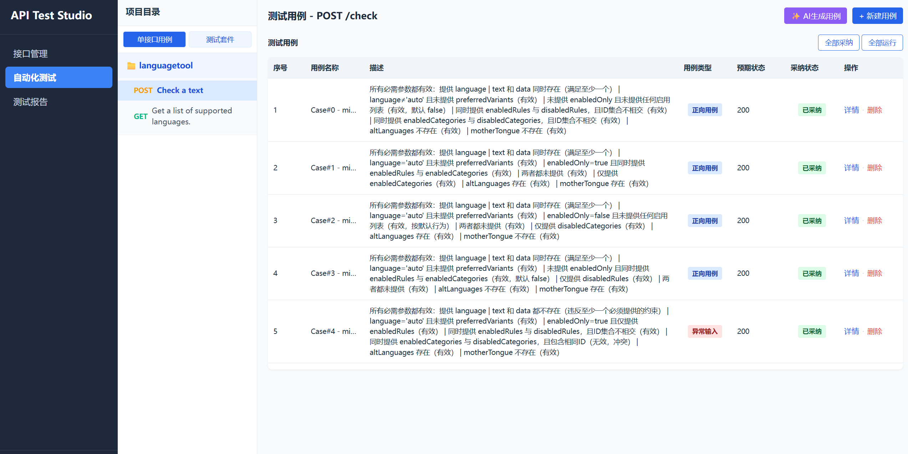

# API Test Studio



一个结合了AI应用和测试专家知识用于 REST API 管理与自动化测试的小工具，包含：

- 前端：React + Vite
- 后端：FastAPI + SQLAlchemy

支持项目与接口管理、接口调试、参数约束与依赖生成、自动化测试执行与报告查看。

此外，这个项目是我和copilot(claude haiku + gpt codex)共同完成的，是一次和ai合作的demo实践，可能在代码规范、鲁棒性上存在一些改进空间。

## 环境要求

- Node.js 18+
- Python 3.10+
- uv（推荐，用于管理后端依赖）

## 快速开始

### 1. 启动后端

进入 backend 目录后执行：

```bash
uv sync
uvicorn main:app --reload --host 0.0.0.0 --port 8080
```

如需使用 AI 相关能力，请在 backend 目录下创建 .env 并配置：

```env
OPENAI_API_KEY=<your_api_key>
OPENAI_MODEL=<model_name>
OPENAI_API_BASE=<open_api_base_url>
```

### 2. 启动前端

进入 frontend 目录后执行：

```bash
npm install
npm run dev
```

默认访问地址：

- 前端：http://localhost:5173
- 后端：http://localhost:8080

## 目录结构

```text
api-test-studio/
├── backend/      # FastAPI 服务与测试生成逻辑
├── frontend/     # React 前端界面
└── README.md
```

## 说明

- 首次启动后端会自动初始化本地数据库。